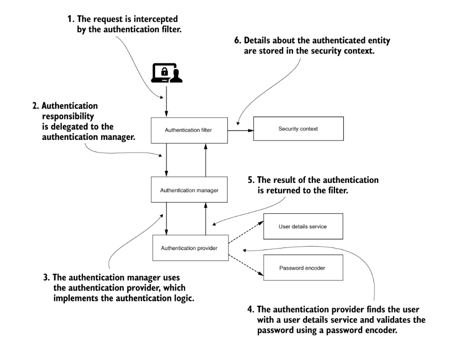

**Basic Authentication:**
    https://github.com/eazybytes/springsecurity6

1. Write one API which returns String and add security dependency.
2. Run the application, You can see the password created in consol. default user us user.
3. Access the Url, it wont work becouse spring boot configured with basic security.
4. Provide user and password in Basic Auth. it will work.
5. We can pass the Base64 tocken in Header also using Autherization :  Basic token
6. Token you can generate by visiting the https://www.base64encode.org/ or (echo -n user:93a01cf0-794b-4b98-86ef-54860f36f7f3 | base64) with the formate of user:password.

**To Enable Https:**

	Windows:
	 
	winpty openssl req -newkey rsa:2048 -x509 -keyout key.pem -out cert.pem -days 365
	winpty openssl pkcs12 -export -in cert.pem -inkey key.pem -out certificate.p12 -name "certificate"
	 
	Linux: 
	openssl req -newkey rsa:2048 -x509 -keyout key.pem -out cert.pem -days 365
	openssl pkcs12 -export -in cert.pem -inkey key.pem -out certificate.p12 -name "certificate"

	copy the certificate.p12 file to resource and add below properties in prop file.
	server.ssl.key-store-type=PKCS12
	server.ssl.key-store=classpath:certificate.p12
	server.ssl.key-store-password=12345 // this is the password you given when executing above commands
 

 **Some Spring Security Configurations**
    SpringBootWebSecurityConfiguration : which have a configuration for basic configration.